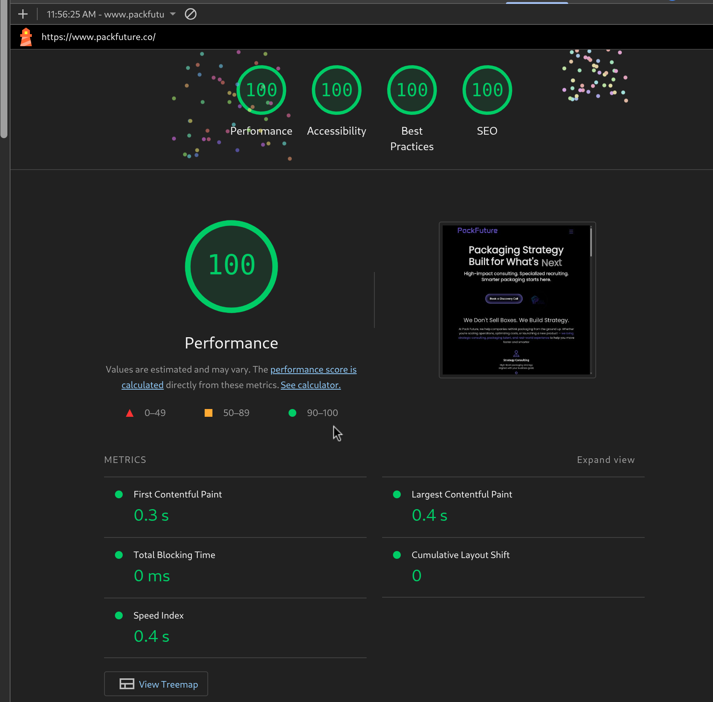

## Lighthouse Performance
Performance improvements were evaluated using Lighthouse audits in Chrome DevTools.

### Performance 

The current implementation achieves strong scores across all major Lighthouse metrics. These improvements were driven by several key optimizations: 
 - reduced JavaScript bundle size
 - optimized image delivery and asset loading
 - animation techniques using GPU-accelerated transforms
 - improved component rendering structure
 - improved semantic HTML structure

These optimizations resulted in faster load times, smoother interactions, and improved accessibility and SEO scores, contributing to a more performant and user-friendly experience.
